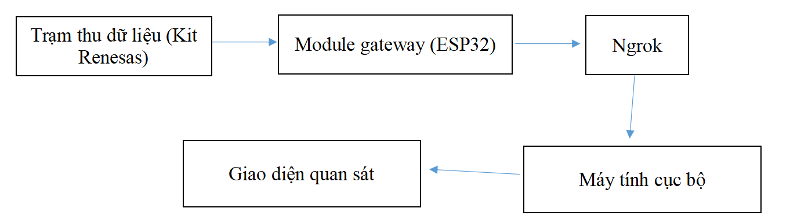
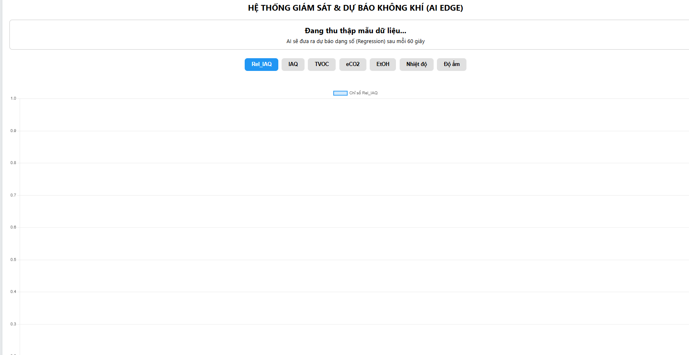
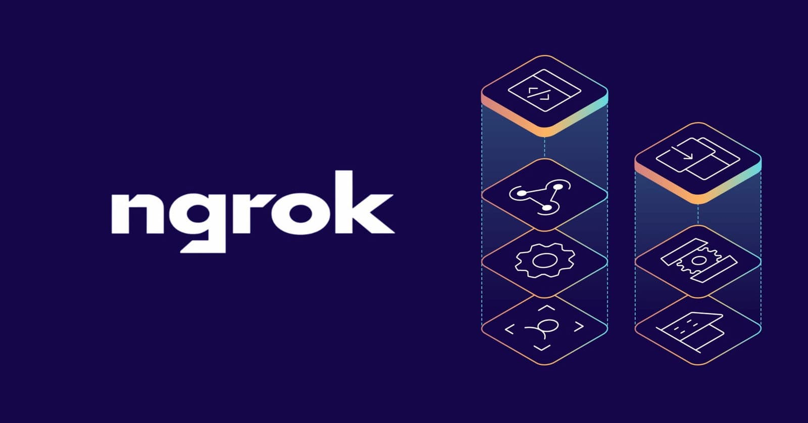
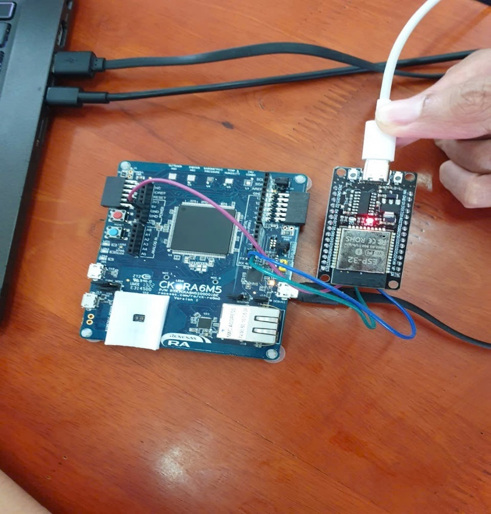

# Web Server và kết nối giữa CK-RA6M5 và ESP32

## Kiến trúc hệ thống

```text
Cảm biến ZMOD4410 / HS300X
          │
          ▼
   CK-RA6M5 (Edge Node)
          │
       UART 115200
          │
          ▼
      ESP32 (Gateway)
          │
     HTTP POST / JSON
          │
          ▼
     Ngrok Tunnel
          │
          ▼
 Web Server Python (cổng 5000)
          │
   WebSockets / Socket.IO
          │
          ▼
       Web Dashboard
```

Trong kiến trúc này, CK-RA6M5 đảm nhiệm thu thập và xử lý dữ liệu ở biên; ESP32 đóng vai trò gateway truyền thông. Dữ liệu từ CK-RA6M5 được chuyển sang ESP32 qua UART ở tốc độ 115200 bps, sau đó ESP32 đóng gói dữ liệu thành JSON và gửi lên Web Server thông qua HTTP POST. fileciteturn6file0L576-L600



## 1. Web Server Python

Web Server được xây dựng bằng Python và đóng vai trò trung tâm trung gian giữa thiết bị phần cứng và giao diện người dùng. Backend tiếp nhận các yêu cầu HTTP từ ESP32, xử lý dữ liệu nhận được và phát dữ liệu mới tới giao diện Web Dashboard. fileciteturn6file0L521-L540

### Backend

Backend thực hiện các nhiệm vụ chính:

- Khởi tạo Web Server cục bộ.
- Tiếp nhận và định tuyến các yêu cầu HTTP.
- Nhận dữ liệu từ ESP32 bằng phương thức `POST`.
- Phân tích các tham số nhận được.
- Trả về mã phản hồi HTTP để xác nhận việc truyền dữ liệu.
- Phát dữ liệu mới tới trình duyệt thông qua WebSockets / Socket.IO.

### Frontend

Giao diện được xây dựng bằng HTML trong thư mục `templates/`. Socket.IO được sử dụng để nhận dữ liệu theo thời gian thực mà không cần tải lại trang. Chart.js dùng để trực quan hóa dữ liệu thành các biểu đồ động. fileciteturn6file0L535-L540



## 2. Kết nối giữa CK-RA6M5 và ESP32

CK-RA6M5 giao tiếp với ESP32 qua **UART**, trong đó:

- CK-RA6M5: thiết bị xử lý dữ liệu tại biên.
- ESP32: gateway truyền thông Wi-Fi.
- Tốc độ UART: **115200 bps**.

ESP32 nhận dữ liệu từ CK-RA6M5, tách các thông số môi trường và đóng gói thành dữ liệu JSON trước khi truyền lên mạng. 

## 3. Truyền dữ liệu qua Ngrok

Web Server ban đầu chỉ chạy trên `localhost`, vì vậy thiết bị ở ngoài mạng nội bộ không thể truy cập trực tiếp. Ngrok được sử dụng để tạo một đường hầm từ Internet về Web Server cục bộ mà không cần cấu hình NAT hoặc IP tĩnh phức tạp. 



Luồng kết nối:

```text
ESP32
  │
  │ HTTP POST + JSON
  ▼
Public URL của Ngrok
  │
  │ Đường hầm mã hóa
  ▼
Ngrok Agent trên máy tính
  │
  ▼
Web Server Python :5000
```

## 4. Định dạng và gửi dữ liệu

ESP32 thực hiện các bước:

1. Nhận chuỗi dữ liệu từ UART.
2. Tách các biến như IAQ, TVOC, eCO2, nhiệt độ, độ ẩm...
3. Đóng gói thành JSON.
4. Tạo HTTP Request với kiểu dữ liệu `application/json`.
5. Gửi bằng phương thức `HTTP POST` tới URL do Ngrok cung cấp.
6. Chờ mã phản hồi từ Server, chẳng hạn `HTTP 200 OK`.
7. Nếu lỗi mạng hoặc timeout, thực hiện gửi lại ở chu kỳ tiếp theo. 

Ví dụ cấu trúc dữ liệu:

```json
{
  "iaq": 120,
  "tvoc": 35,
  "eco2": 650,
  "temperature": 27.5,
  "humidity": 62
}
```

## 5. Cập nhật dữ liệu thời gian thực trên Web

Sau khi Web Server nhận dữ liệu từ ESP32, Backend xử lý và phát dữ liệu qua kênh `update_data`. Trình duyệt nhận dữ liệu bằng Socket.IO và cập nhật biểu đồ ngay lập tức. Vì vậy, người dùng có thể theo dõi biến động dữ liệu mà không cần tải lại trang. 

## 6. Chuỗi hoạt động hoàn chỉnh

```text
ZMOD4410 / HS300X
        ↓
   CK-RA6M5
   Thu thập + xử lý
        ↓ UART 115200
      ESP32
  Đóng gói JSON
        ↓ HTTP POST
      Ngrok
        ↓
 Web Server Python
        ↓ WebSocket
  Web Dashboard
```

Mô hình này tách rõ ba lớp: **xử lý tại thiết bị – truyền thông – hiển thị**, giúp hệ thống giữ phần xử lý dữ liệu ở CK-RA6M5 và giao cho ESP32 nhiệm vụ kết nối mạng. 

## 7. Các điểm kỹ thuật chính

| Thành phần | Vai trò |
|---|---|
| CK-RA6M5 | Thu thập và xử lý dữ liệu tại biên |
| UART | Kênh kết nối CK-RA6M5 ↔ ESP32 |
| ESP32 | Gateway Wi-Fi |
| HTTP POST | Gửi dữ liệu lên Web Server |
| JSON | Định dạng dữ liệu truyền |
| Ngrok | Tạo đường hầm từ Internet về máy chủ nội bộ |
| Python Web Server | Tiếp nhận và xử lý dữ liệu |
| Socket.IO | Cập nhật dữ liệu thời gian thực |
| Chart.js | Hiển thị biểu đồ |

## 8. Hình ảnh minh họa

### Mô hình phần cứng



### Luồng dữ liệu


### Web Dashboard


### Ngrok


